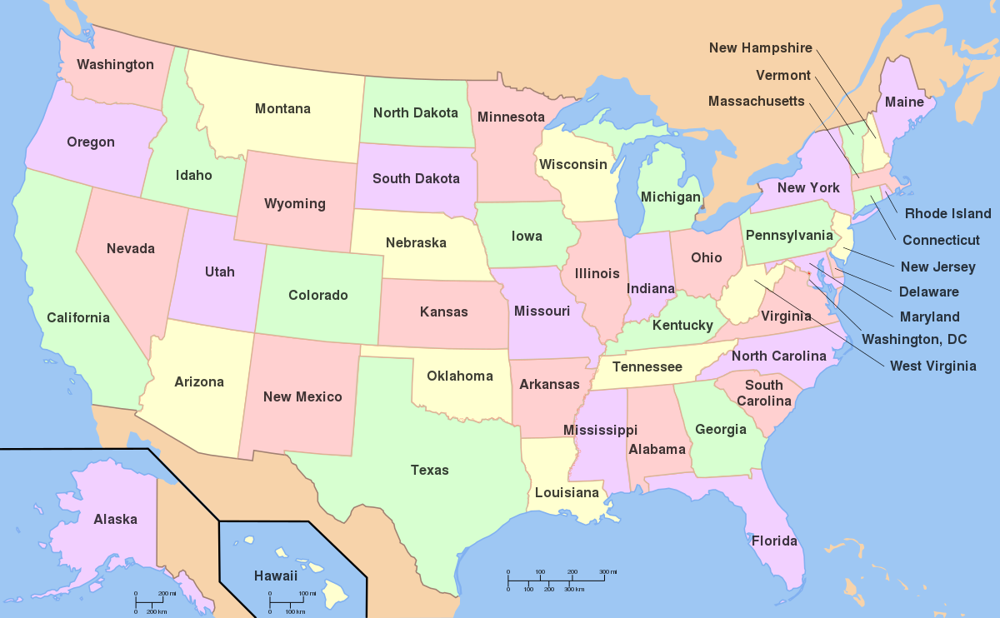

```{r setup, include=FALSE}
knitr::opts_chunk$set(
  echo = TRUE, 
  fig.align = 'center',
  fig.retina = 2,
  fig.width = 8,
  out.width = '100%',
  fig.asp = 0.63
)

```

## Instrucciones generales {.tabset .tabset-fade}

***Objetivo General:*** Analizar el comportamiento de la movilidad de productos de consumo masivo en Estados Unidos durante el periodo julio 2021 a mayo 2022.

***Objetivos específicos:***

1. Caracterización de la movilidad por medio de camiones de productos de consumo masivo de la empresa P&G en Estados Unidos durante el periodo julio 2021 a agosto 2022.
2. Determinar las zonas geográficas con mayor probabilidad de riesgo basado en comportamientos históricos 
3. Diseñar lineamientos para mitigar el riesgo incumplimiento de la cita de recepción y entrega del producto al proveedor y posteriormente al cliente.

### Paquetes


```{r, echo = FALSE}

suppressMessages(suppressWarnings(library(data.table)))
suppressMessages(suppressWarnings(library(tidyverse)))
suppressMessages(suppressWarnings(library(stringr)))
suppressWarnings(suppressMessages(library(lubridate)))
suppressWarnings(suppressMessages(library(DT)))
suppressWarnings(suppressMessages(library(knitr)))
suppressWarnings(suppressMessages(library(ggplot2)))
suppressWarnings(suppressMessages(library(sf)))
suppressWarnings(suppressMessages(library(spData)))
suppressWarnings(suppressMessages(library(plotly)))
suppressWarnings(suppressMessages(library(rvest)))
suppressWarnings(suppressMessages(library(spDataLarge))) 
suppressWarnings(suppressMessages(library(sfnetworks)))
suppressWarnings(suppressMessages(library(rgeos)))
suppressWarnings(suppressMessages(library(sp)))
suppressWarnings(suppressMessages(library(maptools)))
suppressWarnings(suppressMessages(library(rgdal))) # needs gdal > 1.11.0)
suppressWarnings(suppressMessages(library(reshape2)))
suppressWarnings(suppressMessages(library(gridExtra)))
suppressWarnings(suppressMessages(library(scales)))
suppressWarnings(suppressMessages(library(corrgram)))
suppressWarnings(suppressMessages(library(patchwork)))
suppressWarnings(suppressMessages(library(stats)))
suppressWarnings(suppressMessages(library(smacof)))
suppressWarnings(suppressMessages(library(tmap)))
suppressWarnings(suppressMessages(library(psych)))
suppressMessages(suppressWarnings(library(readxl)))
suppressMessages(suppressWarnings(library(stplanr)))
suppressMessages(suppressWarnings(library(kableExtra)))
suppressMessages(suppressWarnings(library(tidymodels)))
suppressMessages(suppressWarnings(library(modeltime)))
suppressMessages(suppressWarnings(library(tidyverse)))
suppressMessages(suppressWarnings(library(timetk)))
suppressMessages(suppressWarnings(library(usmap)))


```


data.table
tidyverse
stringr
lubridate
DT
knitr
ggplot2
sf
spData
plotly
rvest
spDataLarge 
sfnetworks
rgeos
sp
maptools
rgdal
reshape2
gridExtra
scales
corrgram
patchwork
stats
smacof
tmap
psych
readxl
stplanr
kableExtra
tidymodels
modeltime
tidyverse
timetk
usmap


### Análisis exploratorio

Lectura de los datos

Base de datos P&G + https://simplemaps.com/data/us-cities


```{r}

# setwd("C:/Users/carlo/OneDrive/Maestria en Estadistica/II Ciclo 2022/Topicos de Estadistica Espacial Aplicada/Trabajo de investigacion")


base_datos <- read_xlsx("../Dataset - Proyecto.xlsx")


base_datos <- base_datos[,-1]

str(base_datos)


```

Tablas

```{r}


base_datos %>%
  select(id_planta) %>% 
  group_by(id_planta) %>% 
  tally() %>% arrange(-n)  %>% 
  kbl(caption = "") %>%
  kable_classic(full_width = F, html_font = "Cambria")


base_datos %>%
  select(transportista) %>% 
  group_by(transportista) %>% 
  tally() %>% arrange(-n)  %>% 
  kbl(caption = "") %>%
  kable_classic(full_width = F, html_font = "Cambria")


base_datos %>%
  select(estado_origen) %>% 
  group_by(estado_origen) %>% 
  tally() %>% arrange(-n)  %>% 
  kbl(caption = "") %>%
  kable_classic(full_width = F, html_font = "Cambria")


base_datos %>%
  select(estado_destino) %>% 
  group_by(estado_destino) %>% 
  tally() %>% arrange(-n)  %>% 
  kbl(caption = "") %>%
  kable_classic(full_width = F, html_font = "Cambria")


base_datos %>%
  select(cuidad_origen) %>% 
  group_by(cuidad_origen) %>% 
  tally() %>% arrange(-n)  %>% 
  kbl(caption = "") %>%
  kable_classic(full_width = F, html_font = "Cambria")

base_datos %>%
  select(cuidad_destino) %>% 
  group_by(cuidad_destino) %>% 
  tally() %>% arrange(-n)  %>% 
  kbl(caption = "") %>%
  kable_classic(full_width = F, html_font = "Cambria")


```

```{r}

summary(base_datos)

```

Correlación

```{r}

dim(base_datos)

library(corrgram)
corrgram(base_datos %>% select(cantidad_productos,lapso_entrega,riesgo,distancia,peso,tiempo_transito), upper.panel=panel.conf,
diag.panel=panel.density)
mtext("Variables", side=1, cex=1, line = -1.5, outer=TRUE, xpd=NA) #Eje X
mtext("Variables", side=2, cex=1, line = -1.5, outer=TRUE, xpd=NA) #Eje Y


```


Breve analisis temporal

```{r}

# 
# ggplot2::autoplot(base_datos %>% select(dia_entrega,lapso_entrega)) +
#   ylab("Activo neto administrado en dólares") +
#   xlab("Año") +
#   ggtitle("Serie mensual del activo neto administrado en dólares. 2001 - 2022")


```


```{r}


# jpeg("Envios a consumidores por planta.jpg",2500,2000,res=300)


base_datos %>%
  select(id_planta) %>% 
  group_by(id_planta) %>% 
  tally() %>% arrange(-n) %>% 
  ggplot() +
  geom_col(aes(n, reorder(id_planta,n)), fill = "lightblue", width = 0.6) +
  theme_bw() + 
  labs(title="Estados Unidos. Envios a consumidores por planta.", 
       subtitle="Año 2021-2022",
       caption="P&G, 2022",
       x="Cantidad de envios",
       y="Plantas")


#  dev.off()
# # 
# # 
# # 
# jpeg("transportista barplot.jpg",2500,2000,res=300)


base_datos %>%
  select(transportista) %>% 
  group_by(transportista) %>% 
  tally() %>% arrange(-n) %>% 
  ggplot() +
  geom_col(aes(n, reorder(transportista,n)), fill = "lightblue", width = 0.6) +
  theme_bw() + 
  labs(title="Estados Unidos. Envios a consumidores según la empresa transportista.jpg", 
       subtitle="Año 2021-2022",
       caption="P&G, 2022",
       x="Cantidad de envios",
       y="Plantas")

# # 
# dev.off()
# # 
# # 
# # 
# jpeg("estado_origen barplot.jpg",2500,2000,res=300)


base_datos %>%
  select(estado_origen) %>% 
  group_by(estado_origen) %>% 
  tally() %>% arrange(-n) %>% 
  ggplot() +
  geom_col(aes(n, reorder(estado_origen,n)), fill = "lightblue", width = 0.6) +
  theme_bw() + 
  labs(title="Estados Unidos. Envios a consumidores según el estado de origen.", 
       subtitle="Año 2021-2022",
       caption="P&G, 2022",
       x="Cantidad de envios",
       y="Estado Origen")

# 
# dev.off()
# # 
# 
# # 
# jpeg("estado_destino barplot.jpg",2500,2000,res=300)


base_datos %>%
  select(estado_destino) %>% 
  group_by(estado_destino) %>% 
  tally() %>% arrange(-n) %>% head(10) %>% 
  ggplot() +
  geom_col(aes(n, reorder(estado_destino,n)), fill = "lightblue", width = 0.6) +
  theme_bw() + 
  labs(title="Estados Unidos. Top 10 ciudades de origen donde se envia el producto", 
       subtitle="Año 2021-2022",
       caption="P&G, 2022",
       x="Cantidad de envios",
       y="Estado del destino")

# dev.off()
# 
# 
# jpeg("cuidad_origen barplot.jpg",2500,2000,res=300)


base_datos %>%
  select(cuidad_origen) %>% 
  group_by(cuidad_origen) %>% 
  tally() %>% arrange(-n) %>% head(10) %>% 
  ggplot() +
  geom_col(aes(n, reorder(cuidad_origen,n)), fill = "lightblue", width = 0.6) +
  theme_bw() + 
  labs(title="Estados Unidos. Top 10 ciudades de origen donde parte el producto", 
       subtitle="Año 2021-2022",
       caption="P&G, 2022",
       x="Cantidad de envios",
       y="Plantas")


# dev.off()

```





```{r}

usa <- map_data('usa')
head(usa)

state <- map_data("state")
head(state)

county2 <- map_data("county")
head(county2)

ggplot(data=county2, aes(x=long, y=lat, fill=region, group=group)) + 
  geom_polygon(color = "white") + 
  guides(fill="none") + 
  theme(axis.title.x=element_blank(), axis.text.x=element_blank(), axis.ticks.x=element_blank(),
        axis.title.y=element_blank(), axis.text.y=element_blank(), axis.ticks.y=element_blank()) + 
  ggtitle('U.S. Mapa de los counties de USA por estado') + 
  coord_fixed(1.3)

```


```{r}

plot_usmap(regions = "states") + 
  labs(title = "U.S. States",
       subtitle = "Mapa en blanco de los estados de Estados Unidos.") + 
  theme(panel.background=element_blank())


plot_usmap(regions = "county") + 
  labs(title = "U.S. counties",
       subtitle = "Mapa en blanco de los condados de Estados Unidos.") + 
  theme(panel.background=element_blank())


```


### Estadisticas Plantas P&G

```{r}

```


County - Origen. Donde salió el producto

```{r}


stats_county_origen <- base_datos %>% select(estado_origen,county_origin,cantidad_productos,lapso_entrega,riesgo,distancia,peso,tiempo_transito) %>% 
  group_by(estado_origen,county_origin) %>% 
  summarise("Cantidad de productos" = mean(cantidad_productos), "Duración entre pedido y entrega" = mean(lapso_entrega), "riesgo" = mean(riesgo)*100,"distancia" = mean(distancia), "peso" = mean(peso),"tiempo en tránsito" = mean(tiempo_transito))

head(stats_county_origen)


stats_county_origen_m <- base::merge(x = stats_county_origen,y = county2, by.x = "county_origin", by.y = "subregion",all.x = TRUE)


stats_county_origen_todo <- base::merge(x = stats_county_origen,y = county2, by.x = "county_origin", by.y = "subregion",all.y = TRUE)


stats_county_origen_m2 <- stats_county_origen_m %>% arrange(group,order)


head(stats_county_origen_m2)


```

Estados Unidos. Plantas de producto de la empresa P&G

```{r}


states_1 <- county2[county2$region %in% stats_county_origen_m$county_origin,]

app <- county2[paste(county2$region, county2$subregion) %in%
 paste(stats_county_origen_m$estado_origen, stats_county_origen_m$county_origin),]

ken <- app[app$region == "california",]

ggplot(state, aes(long, lat, group = group)) + 
  geom_polygon(fill = "white", colour = "gray75") +
  geom_polygon(fill = "black", data = app, colour = "white") +
  geom_polygon(fill = "blue", data = ken, colour = "white") +
  coord_equal() +
  theme_void() + 
    labs(title="Estados Unidos. Plantas de producto de la empresa P&G", 
       subtitle="Año 2021-2022",
       caption="P&G, 2022",
       x="Cantidad de envios",
       y="Plantas")

```


Estados Unidos. Plantas de producto de la empresa P&G detallado

```{r}


ggplot(stats_county_origen_todo, aes(long, lat, group = group)) +
  geom_polygon(fill = "white", colour = "gray75") +
  geom_polygon(data = stats_county_origen_m2, fill = "blue", colour = "white") +
  # geom_polygon(fill = "blue", data = ken, colour = "white") +
  coord_equal() +
  theme_void() + 
    labs(title="Estados Unidos. Plantas de producto de la empresa P&G", 
       subtitle="Año 2021-2022",
       caption="P&G, 2022",
       x="Cantidad de envios",
       y="Plantas")


```


Estados Unidos. Riesgo

```{r}


ggplot(stats_county_origen_todo, aes(long, lat, group = group, fill = riesgo)) +
  geom_polygon(fill = "white", colour = "gray75") +
  geom_polygon(data = stats_county_origen_m2, colour = "white") +
  coord_equal() +
  theme_void() + 
    labs(title="Estados Unidos. Plantas de producto de la empresa P&G", 
       subtitle="Año 2021-2022",
       caption="P&G, 2022",
       x="Cantidad de envios",
       y="Plantas")

```


Estados Unidos. distancia

```{r}


ggplot(stats_county_origen_todo, aes(long, lat, group = group, fill = distancia)) +
  geom_polygon(fill = "white", colour = "gray75") +
  geom_polygon(data = stats_county_origen_m2, colour = "white") +
  coord_equal() +
  theme_void() + 
    labs(title="Estados Unidos. Plantas de producto de la empresa P&G", 
       subtitle="Año 2021-2022",
       caption="P&G, 2022",
       x="Cantidad de envios",
       y="Plantas")

```

Estados Unidos. Peso

```{r}


ggplot(stats_county_origen_todo, aes(long, lat, group = group, fill = peso)) +
  geom_polygon(fill = "white", colour = "gray75") +
  geom_polygon(data = stats_county_origen_m2, colour = "white") +
  coord_equal() +
  theme_void() + 
    labs(title="Estados Unidos. Plantas de producto de la empresa P&G clasificadas por peso", 
       subtitle="Año 2021-2022",
       caption="P&G, 2022",
       x="Cantidad de envios",
       y="Plantas")

```


Estados Unidos. tiempo en tránsito

```{r}


ggplot(stats_county_origen_todo, aes(long, lat, group = group, fill = `tiempo en tránsito`)) +
  geom_polygon(fill = "white", colour = "gray75") +
  geom_polygon(data = stats_county_origen_m2, colour = "white") +
  coord_equal() +
  theme_void() + 
    labs(title="Estados Unidos. Plantas de producto de la empresa P&G clasificadas por tiempo en tránsito", 
       subtitle="Año 2021-2022",
       caption="P&G, 2022",
       x="Cantidad de envios",
       y="Plantas")

```


Estados Unidos. Cantidad de productos

```{r}


ggplot(stats_county_origen_todo, aes(long, lat, group = group, fill = `Cantidad de productos`)) +
  geom_polygon(fill = "white", colour = "gray75") +
  geom_polygon(data = stats_county_origen_m2, colour = "white") +
  coord_equal() +
  theme_void() + 
    labs(title="Estados Unidos. Plantas de producto de la empresa P&G clasificadas por cantidad de productos ", 
       subtitle="Año 2021-2022",
       caption="P&G, 2022",
       x="Cantidad de envios",
       y="Plantas")

```


Estados Unidos. Duración entre pedido y entrega

```{r}


ggplot(stats_county_origen_todo, aes(long, lat, group = group, fill = `Duración entre pedido y entrega`)) +
  geom_polygon(fill = "white", colour = "gray75") +
  geom_polygon(data = stats_county_origen_m2, colour = "white") +
  coord_equal() +
  theme_void() +
    labs(title="Estados Unidos. Plantas de producto de la empresa P&G", 
       subtitle="Año 2021-2022",
       caption="P&G, 2022")

```


Estado con mayor plantas y flujo de productos


```{r}


california <- subset(state, region=="california")
california_county <- subset(county2, region=="california")

ca_map <- ggplot(data=california, mapping=aes(x=long, y=lat, group=group)) +
  coord_fixed(1.3) +
  geom_polygon(color="black", fill="gray") +
  geom_polygon(data=california_county, fill=NA, color="white") +
  geom_polygon(color="black", fill=NA) +
  ggtitle('Washington Map with Counties') +
  theme(axis.title.x=element_blank(), axis.text.x=element_blank(), axis.ticks.x=element_blank(),
        axis.title.y=element_blank(), axis.text.y=element_blank(), axis.ticks.y=element_blank())
ca_map


# ---------------------
  
  

states_cal <-  stats_county_origen_todo[stats_county_origen_todo$region %in% "california",]
  

stats_county_cal <- stats_county_origen_m[stats_county_origen_m$region %in% "california",]


app <- county2[paste(county2$region, county2$subregion) %in%
 paste(stats_county_cal$estado_origen, stats_county_cal$county_origin),]

ken <- app[app$region == "california",]


ggplot(states_cal, aes(long, lat, group = group)) +
  geom_polygon(fill = "white", colour = "gray75") +
  geom_polygon(fill = "red", data = app, colour = "white") +
  geom_polygon(fill = "blue", data = ken, colour = "white") +
  coord_equal() +
  theme_void() +
    labs(title="California. Plantas de producto de la empresa P&G",
       subtitle="Año 2021-2022",
       caption="P&G, 2022")


```


<!--  -->

### Estadisticas Destino


County - Destino. Donde se entrega el producto

```{r}


stats_county_destino <- base_datos %>% select(estado_destino,county_dest,cantidad_productos,lapso_entrega,riesgo,distancia,peso,tiempo_transito) %>% 
  group_by(estado_destino,county_dest) %>% 
  summarise("Cantidad de productos" = mean(cantidad_productos), "Duración entre pedido y entrega" = mean(lapso_entrega), "riesgo" = mean(riesgo)*100,"distancia" = mean(distancia), "peso" = mean(peso),"tiempo en tránsito" = mean(tiempo_transito))

head(stats_county_destino)


stats_county_destino_m <- base::merge(x = stats_county_destino,y = county2, by.x = "county_dest", by.y = "subregion",all.x = TRUE)


stats_county_destino_todo <- base::merge(x = stats_county_destino,y = county2, by.x = "county_dest", by.y = "subregion",all.y = TRUE)


stats_county_destino_m2 <- stats_county_destino_m %>% arrange(group,order)


head(stats_county_destino_m2)


```

Estados Unidos. Plantas de producto de la empresa P&G

```{r}


states_1 <- county2[county2$region %in% stats_county_destino_m$county_dest,]

app <- county2[paste(county2$region, county2$subregion) %in%
 paste(stats_county_destino_m$estado_destino, stats_county_destino_m$county_dest),]

ken <- app[app$region == "california",]

ggplot(state, aes(long, lat, group = group)) + 
  geom_polygon(fill = "white", colour = "gray75") +
  geom_polygon(fill = "black", data = app, colour = "white") +
  coord_equal() +
  theme_void() + 
    labs(title="Estados Unidos. Destinos de producto de la empresa P&G", 
       subtitle="Año 2021-2022",
       caption="P&G, 2022",
       x="Cantidad de envios",
       y="Plantas")

```


Estados Unidos. Plantas de producto de la empresa P&G detallado

```{r}


ggplot(stats_county_destino_todo, aes(long, lat, group = group)) +
  geom_polygon(fill = "white", colour = "gray75") +
  geom_polygon(data = stats_county_destino_m2, fill = "blue", colour = "white") +
  # geom_polygon(fill = "blue", data = ken, colour = "white") +
  coord_equal() +
  theme_void() + 
    labs(title="Estados Unidos. Destinos de producto de la empresa P&G", 
       subtitle="Año 2021-2022",
       caption="P&G, 2022",
       x="Cantidad de envios",
       y="Plantas")


```


Estados Unidos. Riesgo

```{r}


ggplot(stats_county_destino_todo, aes(long, lat, group = group, fill = riesgo)) +
  geom_polygon(fill = "white", colour = "gray75") +
  geom_polygon(data = stats_county_destino_m2, colour = "white") +
  coord_equal() +
  theme_void() + 
    labs(title="Estados Unidos. Destinos de producto de la empresa P&G", 
       subtitle="Año 2021-2022",
       caption="P&G, 2022",
       x="Cantidad de envios",
       y="Plantas")

```


Estados Unidos. distancia

```{r}


ggplot(stats_county_destino_todo, aes(long, lat, group = group, fill = distancia)) +
  geom_polygon(fill = "white", colour = "gray75") +
  geom_polygon(data = stats_county_destino_m2, colour = "white") +
  coord_equal() +
  theme_void() + 
    labs(title="Estados Unidos. Destinos de producto de la empresa P&G", 
       subtitle="Año 2021-2022",
       caption="P&G, 2022",
       x="Cantidad de envios",
       y="Plantas")

```

Estados Unidos. Peso

```{r}


ggplot(stats_county_destino_todo, aes(long, lat, group = group, fill = peso)) +
  geom_polygon(fill = "white", colour = "gray75") +
  geom_polygon(data = stats_county_destino_m2, colour = "white") +
  coord_equal() +
  theme_void() + 
    labs(title="Estados Unidos. Destinos de producto de la empresa P&G clasificadas por peso", 
       subtitle="Año 2021-2022",
       caption="P&G, 2022",
       x="Cantidad de envios",
       y="Plantas")

```


Estados Unidos. XXXX

```{r}


ggplot(stats_county_destino_todo, aes(long, lat, group = group, fill = `tiempo en tránsito`)) +
  geom_polygon(fill = "white", colour = "gray75") +
  geom_polygon(data = stats_county_destino_m2, colour = "white") +
  coord_equal() +
  theme_void() + 
    labs(title="Estados Unidos. Destinos de producto de la empresa P&G clasificadas por tiempo en tránsito", 
       subtitle="Año 2021-2022",
       caption="P&G, 2022",
       x="Cantidad de envios",
       y="Plantas")

```


Estados Unidos. Cantidad de productos

```{r}


ggplot(stats_county_destino_todo, aes(long, lat, group = group, fill = `Cantidad de productos`)) +
  geom_polygon(fill = "white", colour = "gray75") +
  geom_polygon(data = stats_county_destino_m2, colour = "white") +
  coord_equal() +
  theme_void() + 
    labs(title="Estados Unidos. Destinos de producto de la empresa P&G clasificadas por cantidad de productos ", 
       subtitle="Año 2021-2022",
       caption="P&G, 2022",
       x="Cantidad de envios",
       y="Plantas")

```


Estados Unidos. Duración entre pedido y entrega

```{r}


ggplot(stats_county_destino_todo, aes(long, lat, group = group, fill = `Duración entre pedido y entrega`)) +
  geom_polygon(fill = "white", colour = "gray75") +
  geom_polygon(data = stats_county_destino_m2, colour = "white") +
  coord_equal() +
  theme_void() +
    labs(title="Estados Unidos. Destinos de producto de la empresa P&G", 
       subtitle="Año 2021-2022",
       caption="P&G, 2022")

```


Estado con mayor plantas y flujo de productos


```{r}


california <- subset(state, region=="california")
california_county <- subset(county2, region=="california")

ca_map <- ggplot(data=california, mapping=aes(x=long, y=lat, group=group)) +
  coord_fixed(1.3) +
  geom_polygon(color="black", fill="gray") +
  geom_polygon(data=california_county, fill=NA, color="white") +
  geom_polygon(color="black", fill=NA) +
  ggtitle('Washington Map with Counties') +
  theme(axis.title.x=element_blank(), axis.text.x=element_blank(), axis.ticks.x=element_blank(),
        axis.title.y=element_blank(), axis.text.y=element_blank(), axis.ticks.y=element_blank())
ca_map


```


### Rutas


https://rstudio-pubs-static.s3.amazonaws.com/485343_dc9f11a9c9824945be5544369ddc88d4.html
https://rstudio-pubs-static.s3.amazonaws.com/259095_2f8cb24b43284692a8af916bd447931d.html

***sf transformation***


```{r}


rutas <- base_datos %>% select(cuidad_origen,cuidad_destino,county_origin,county_dest,estado_origen,estado_destino,destino_lat,destino_long,origen_lat,origen_long) %>% 
  group_by(cuidad_origen,cuidad_destino,county_origin,county_dest,estado_origen,estado_destino,destino_lat,destino_long,origen_lat,origen_long) %>% 
  tally()


rutas <- unique(rutas) %>% arrange("destino_lat"  ,  "destino_long"  , "origen_lat"   ,  "origen_long")
rutas$igualdad <- ifelse(rutas$cuidad_origen == rutas$cuidad_destino, "duplicado", "unica")
table(rutas$igualdad)
df2<-rutas[!rutas$igualdad=="duplicado",]


allUSA <- ggplot() + borders("state", colour="grey", fill="white") +
  geom_curve(data=df2,
             aes(x=origen_long, y=origen_lat, xend=destino_long, yend=destino_lat),
             col="#00008b",
             linewidth=.5,
             curvature=0.2) +
  geom_point(data=df2,
             aes(x=origen_long, y=origen_lat),
             colour="red",
             size=1.5) +
  geom_point(data=df2,
             aes(x=destino_long, y=destino_lat),
             colour="green") +
  theme(axis.line=element_blank(),
        axis.text.x=element_blank(),
        axis.text.y=element_blank(),
        axis.title.x=element_blank(),
        axis.title.y=element_blank(),
        axis.ticks=element_blank(),
        plot.title=element_text(hjust=0.5, size=12))  + 
    labs(title="Estados Unidos. Plantas de producto de la empresa P&G clasificadas por cantidad de productos ", 
       subtitle="Año 2021-2022",
       caption="P&G, 2022",
       x="Cantidad de envios",
       y="Plantas")


allUSA


```


```{r}


top50_rutas <- df2 %>% arrange(-n) %>% head(50)

top50_rutas %>% select(-igualdad) %>% 
  kbl(caption = "") %>%
  kable_classic(full_width = F, html_font = "Cambria")


top5_rutas <- df2 %>% arrange(-n) %>% head(5)

top50_rutas_USA <- ggplot() + borders("state", colour="grey", fill="white") +
  geom_polygon(data = stats_county_origen_m2, aes(long, lat, group = group)) +
  coord_equal() +
  geom_curve(data=top50_rutas,
             aes(x=origen_long, y=origen_lat, xend=destino_long, yend=destino_lat),
             col="#00008b",
             linewidth=.5,
             curvature=0.2) +
  geom_curve(data=top5_rutas,
             aes(x=origen_long, y=origen_lat, xend=destino_long, yend=destino_lat),
             col="#00008b",
             linewidth=1.5,
             curvature=0.2) +
  geom_point(data=top50_rutas,
             aes(x=origen_long, y=origen_lat),
             colour="red",
             size=1.5) +
  geom_point(data=top50_rutas,
             aes(x=destino_long, y=destino_lat),
             colour="green") +
  theme(axis.line=element_blank(),
        axis.text.x=element_blank(),
        axis.text.y=element_blank(),
        axis.title.x=element_blank(),
        axis.title.y=element_blank(),
        axis.ticks=element_blank(),
        plot.title=element_text(hjust=0.5, size=12))  + 
    labs(title="Estados Unidos. Top 50 rutas terrestres por cantidad de envios", 
       subtitle="Año 2021-2022",
       caption="P&G, 2022",
       x="Cantidad de envios",
       y="Plantas")


top50_rutas_USA

```


### zona geográfica (Estado / provincia) 


```{r}


stats_rutas <- base_datos %>%
  select(cuidad_origen,cuidad_destino,county_origin,county_dest,estado_origen,estado_destino,destino_lat,destino_long,origen_lat,origen_long,cantidad_productos,lapso_entrega,riesgo,distancia,peso,tiempo_transito) %>% 
  group_by(cuidad_origen,cuidad_destino,county_origin,county_dest,estado_origen,estado_destino,destino_lat) %>% 
  summarise("Cantidad de productos" = mean(cantidad_productos), "Duración entre pedido y entrega" = mean(lapso_entrega), "riesgo" = mean(riesgo)*100,"distancia" = mean(distancia), "peso" = mean(peso),"tiempo en tránsito" = mean(tiempo_transito), n = n()) %>% 
  ungroup()


head(stats_rutas)

stats_rutas$igualdad <- ifelse(stats_rutas$cuidad_origen == stats_rutas$cuidad_destino, "duplicado", "unica")
table(stats_rutas$igualdad)

stats_rutas2<-stats_rutas[!stats_rutas$igualdad=="duplicado",]


```


```{r}


# jpeg("Envios a consumidores por planta.jpg",2500,2000,res=300)


stats_rutas2 %>% 
  select(cuidad_origen,cuidad_destino,distancia) %>% 
  mutate("ruta" = paste(cuidad_origen, "-", cuidad_destino)) %>% 
  select(ruta,distancia) %>% 
  arrange(-distancia) %>% 
  head(10) %>% 
  ggplot() +
  geom_col(aes(distancia, reorder(ruta,distancia)), fill = "lightblue", width = 0.6) +
  theme_bw() + 
  labs(title="Estados Unidos. Distancias más largas", 
       subtitle="Año 2021-2022",
       caption="P&G, 2022",
       x="Cantidad de envios",
       y="Plantas")
  

```


riesgo

```{r}


stats_rutas2 %>% 
  select(cuidad_origen,cuidad_destino,riesgo) %>% 
  mutate("ruta" = paste(cuidad_origen, "-", cuidad_destino)) %>% 
  select(ruta,riesgo) %>% 
  arrange(-riesgo) %>% 
  head(10) %>% 
  ggplot() +
  geom_col(aes(riesgo, reorder(ruta,riesgo)), fill = "lightblue", width = 0.6) +
  theme_bw() + 
  labs(title="Estados Unidos. Rutas con mayor probabilidad de riesgo", 
       subtitle="Año 2021-2022",
       caption="P&G, 2022",
       x="Cantidad de envios",
       y="Plantas")

```

peso

```{r}


stats_rutas2 %>% 
  select(cuidad_origen,cuidad_destino,peso) %>% 
  mutate("ruta" = paste(cuidad_origen, "-", cuidad_destino)) %>% 
  select(ruta,peso) %>% 
  arrange(-peso) %>% 
  head(10) %>% 
  ggplot() +
  geom_col(aes(peso, reorder(ruta,peso)), fill = "lightblue", width = 0.6) +
  theme_bw() + 
  labs(title="Estados Unidos. Rutas donde se transporta más peso en promedio", 
       subtitle="Año 2021-2022",
       caption="P&G, 2022",
       x="Cantidad de envios",
       y="Plantas")

```

tiempo en tránsito

```{r}


stats_rutas2 %>% 
  select(cuidad_origen,cuidad_destino,`tiempo en tránsito`) %>% 
  mutate("ruta" = paste(cuidad_origen, "-", cuidad_destino)) %>% 
  select(ruta,`tiempo en tránsito`) %>% 
  arrange(-`tiempo en tránsito`) %>% 
  head(10) %>% 
  ggplot() +
  geom_col(aes(`tiempo en tránsito`, reorder(ruta,`tiempo en tránsito`)), fill = "lightblue", width = 0.6) +
  theme_bw() + 
  labs(title="Estados Unidos. Distancias a largas", 
       subtitle="Año 2021-2022",
       caption="P&G, 2022",
       x="Cantidad de envios",
       y="Plantas")

```

Cantidad de productos

```{r}


stats_rutas2 %>% 
  select(cuidad_origen,cuidad_destino,`Cantidad de productos`) %>% 
  mutate("ruta" = paste(cuidad_origen, "-", cuidad_destino)) %>% 
  select(ruta,`Cantidad de productos`) %>% 
  arrange(-`Cantidad de productos`) %>% 
  head(10) %>% 
  ggplot() +
  geom_col(aes(`Cantidad de productos`, reorder(ruta,`Cantidad de productos`)), fill = "lightblue", width = 0.6) +
  theme_bw() + 
  labs(title="Estados Unidos. Distancias más largas", 
       subtitle="Año 2021-2022",
       caption="P&G, 2022",
       x="Cantidad de envios",
       y="Plantas")

```


### Análsis de las empresas transportistas 


```{r}


```


```{r}
```


```{r}
```


```{r}
```

